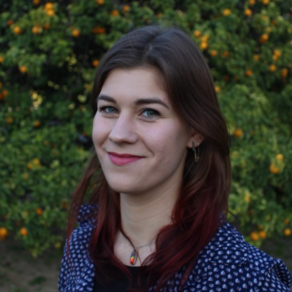

---
hide:
  - navigation
#   - toc
---

-    
    __John Barton, PI__&nbsp;&nbsp;
    <small>
    [:fontawesome-brands-google-scholar:{ .middle }](https://scholar.google.com/citations?user=ItAcAOMAAAAJ) 
    [:fontawesome-brands-github:{ .middle }](https://github.com/johnbarton) 
    John is an Associate Professor of Computational and Systems Biology at the University of Pittsburgh. He studies pathogen evolution and immunology using methods inspired by statistical physics.
    </small>

-    
    __Edwin Rodriguez Horta, Postdoc__&nbsp;&nbsp;
    <small>
    [:fontawesome-brands-google-scholar:{ .middle }](https://scholar.google.com/citations?user=8trQrlgAAAAJ)
     
    Edwin is a physicist and quantitative biologist focused on developing computational methods inspired by statistical physics and statistical learning to understand and predict complex biological systems, such as the phenomenology of evolution and the immune system.
    </small>

-    
    __Kai Shimagaki, Postdoc__&nbsp;&nbsp;
    <small>
    [:fontawesome-brands-google-scholar:{ .middle }](https://scholar.google.com/citations?user=BJF41UIAAAAJ)
    [:fontawesome-brands-github:{ .middle }](https://github.com/shimagaki)
     
    Kai uses theoretical and computational methods to study evolution, with a particular interest in epistasis and host-pathogen coevolution.
    </small>

-    
    __Liz Finney, Graduate Student__&nbsp;&nbsp;
    <small>
    [:fontawesome-solid-bolt-lightning:{ .middle }](https://sites.google.com/view/ucr-powur/)
     
    Liz studies computational epidemiology, immunology, and the evolution of viral pathogens. Most recently, she is working on a project involving SARS-CoV-2. In her spare time, she helps lead POWUR, a student-created group working to foster a climate of diversity, equity, and inclusion in physics.
    </small>

-    
    __Yirui Gao, Graduate Student__&nbsp;&nbsp;
    <small>
    [:fontawesome-brands-github:{ .middle }](https://github.com/yiruigaoo)
     
    Yirui is interested in fitness inference from evolutionary histories using methods from statistical physics. Recently, she has been working on using quantitative trait models to study HIV evolution.
    </small>

-    
    __Brian Lee, Graduate Student__&nbsp;&nbsp;
    <small>
    [:fontawesome-brands-github:{ .middle }](https://github.com/leebs92)
     
    Brian is developing quantitative methods to study SARS-CoV-2 evolution. He has also studied how immune cells use the information provided by their environment to make decisions. More generally, he is interested in information processing and its relationship to decision theory.
    </small>

-    
    __Kevin Yang, Graduate Student__&nbsp;&nbsp;
    <small>
    [:fontawesome-brands-google-scholar:{ .middle }](https://scholar.google.com/citations?user=tdb3IasAAAAJ)
     
    Kevin Yang is currently studying immune activation and biochemical signaling networks. His past research focused on physics and public health topics in China, Australia, and the United Kingdom.
    </small>

## Alumni

### Graduate students

**Yunxiao Li**, PhD student in University of California, Riverside Department of Physics and Astronomy. Graduated 2022. Currently at Cardinal Biocraft.

**Marco Garcia Noceda**, PhD student in University of California, Riverside Department of Physics and Astronomy. Graduated 2023. Currently at Adaptive Biotechnologies.

**Yawei Qin**, PhD student in University of California, Riverside Department of Physics and Astronomy. Graduated 2023. Currently at CGG SA.

**Zhenchen Hong**, PhD student in University of California, Riverside Department of Physics and Astronomy. Graduated 2023. Currently at Ernst and Young.

### Rotation students

**Alex DiBiasi**, PhD student in the CMU-Pitt Computational Biology Graduate Program, 2022.

**Emma Flynn**, PhD student in the CMU-Pitt Computational Biology Graduate Program, 2023.

### Undergraduate students

**Uchenna Nwaege**, Physics major and MARC U STAR Scholar at the University of California, Riverside. Graduated 2023. Currently a graduate student at the University of Michigan.

**Camille Rotemberg**, TECBio REU student, 2023. Currently an undergraduate student at Cooper Union.

