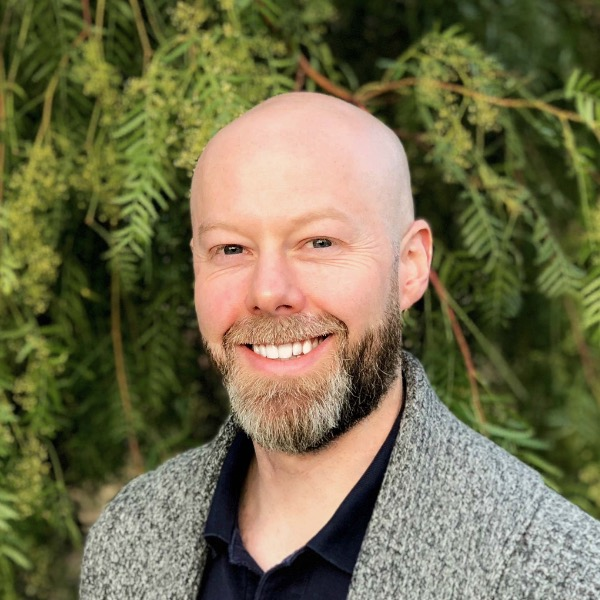
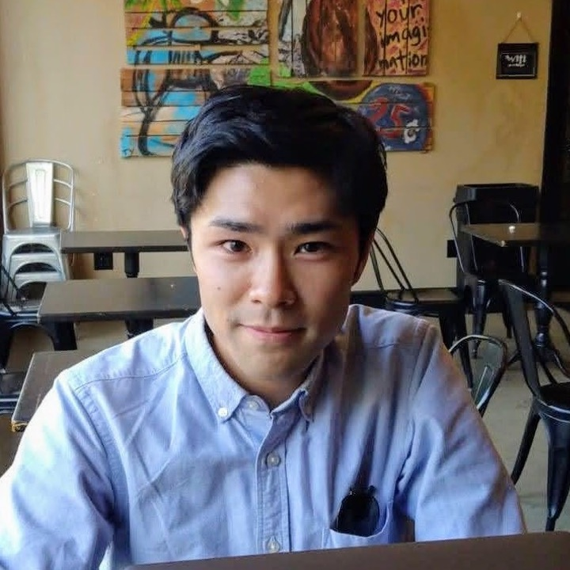
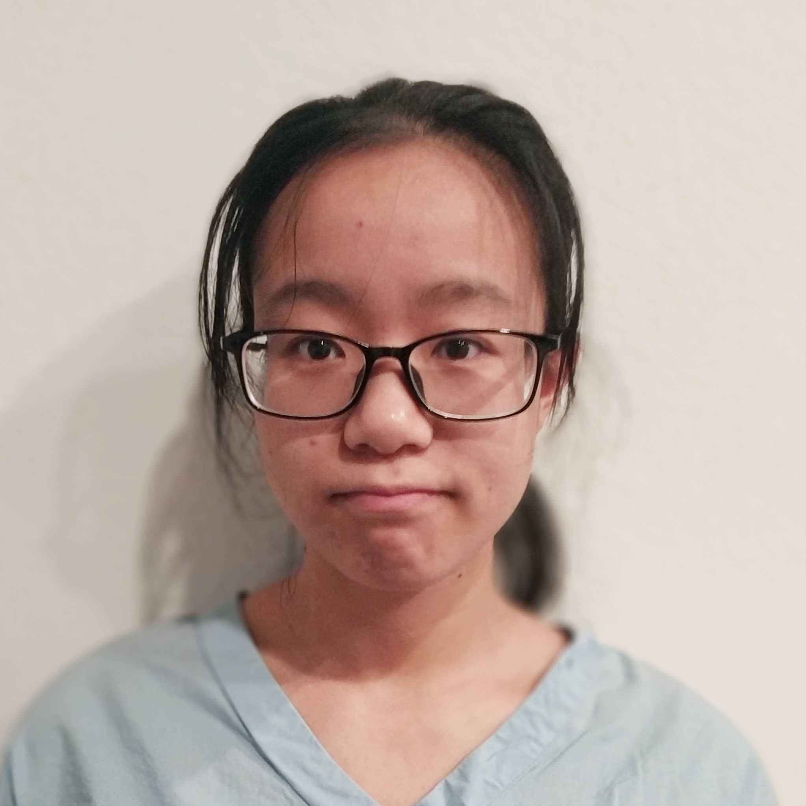
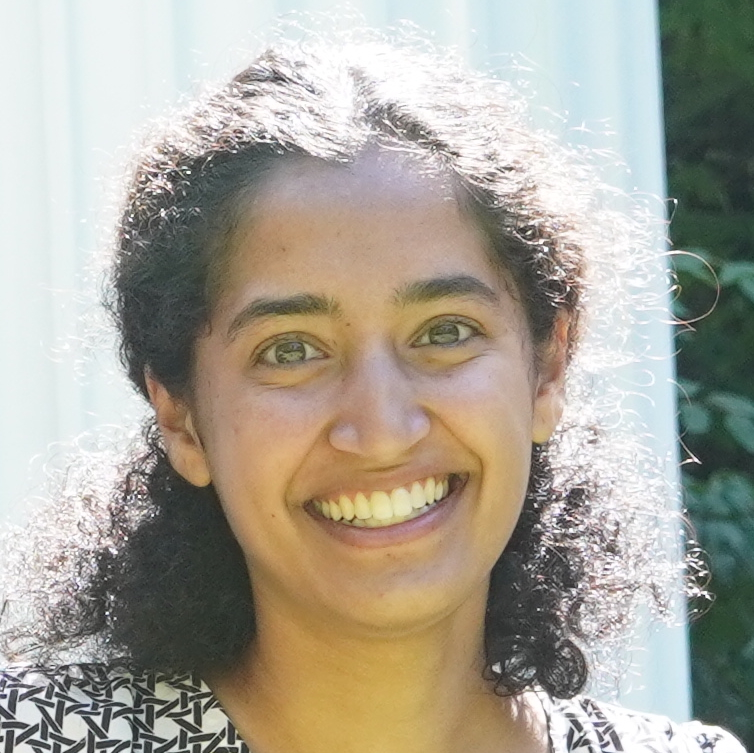

---
hide:
  - navigation
#   - toc
---

-    
    __John Barton, PI__&nbsp;&nbsp;
    <small>
    [:fontawesome-brands-google-scholar:{ .middle }](https://scholar.google.com/citations?user=ItAcAOMAAAAJ) 
    [:fontawesome-brands-github:{ .middle }](https://github.com/johnbarton) 
    John is an Associate Professor of Computational and Systems Biology at the University of Pittsburgh. He studies pathogen evolution and immunology using methods inspired by statistical physics.
    </small>

-    
    __Edwin Rodriguez Horta, Postdoc__&nbsp;&nbsp;
    <small>
    [:fontawesome-brands-google-scholar:{ .middle }](https://scholar.google.com/citations?user=8trQrlgAAAAJ)
     
    Edwin is a physicist and quantitative biologist focused on developing computational methods inspired by statistical physics and statistical learning to understand and predict complex biological systems, such as the phenomenology of evolution and the immune system.
    </small>

-    
    __Kai Shimagaki, Postdoc__&nbsp;&nbsp;
    <small>
    [:fontawesome-brands-google-scholar:{ .middle }](https://scholar.google.com/citations?user=BJF41UIAAAAJ)
    [:fontawesome-brands-github:{ .middle }](https://github.com/shimagaki)
     
    Kai is a postdoc who obtained his Ph.D. in information science at Sorbonne University Paris 1 under the supervision of Dr. Martin Weigt. He is passionate about understanding rapidly evolving pathogens and immunities, with a particular interest in epistasis and coevolution. His research policy focuses on a quantitative understanding through the lenses of population genomics and statistical physics with great care for real biological phenomena and data.
    </small>

-    
    __Yirui Gao, Graduate Student__&nbsp;&nbsp;
    <small>
    [:fontawesome-brands-github:{ .middle }](https://github.com/yiruigaoo)
     
    Yirui is interested in fitness inference from evolutionary histories using methods from statistical physics. Recently, she has been working on using quantitative trait models to study HIV evolution.
    </small>

-    
    __Gargi Kher, Graduate Student__&nbsp;&nbsp;
    <small>
    [:fontawesome-brands-github:{ .middle }](https://github.com/kherg)
     
    Gargi is a CMU-Pitt Computational Biology PhD student co-mentored by [Dr. Shikhar Uttam](https://www.uttamlab.com/). She's broadly interested in using quantitative methods to understand how the decisions, interactions and spatial organization of components of our immune system contribute to disease.
    </small>

<!-- 
-    
    __Maddie Shaklee, Graduate Student__&nbsp;&nbsp;
    <small>
    [:fontawesome-brands-github:{ .middle }](https://github.com/kherg)
     
    Maddie is a CMU-Pitt Computational Biology PhD student co-mentored by [Dr. Harinder Singh](https://www.immunology.pitt.edu/people/harinder-singh-phd). She's broadly interested in using quantitative methods to understand how the decisions, interactions and spatial organization of components of our immune system contribute to disease.
    </small>
-->

## Alumni

### Graduate students

**Liz Finney**, PhD student in University of California, Riverside Department of Physics and Astronomy. Graduated 2025. 

**Brian Lee**, PhD student in University of California, Riverside Department of Physics and Astronomy. Graduated 2025. 

**Kevin Yang**, PhD student in University of California, Riverside Biophysics Graduate Program. Currently working with [Roya Zandi](https://zandilab.ucr.edu/) at UCR.

**Yunxiao Li**, PhD student in University of California, Riverside Department of Physics and Astronomy. Graduated 2022. Currently at Cardinal Biocraft.

**Marco Garcia Noceda**, PhD student in University of California, Riverside Department of Physics and Astronomy. Graduated 2023. Currently at Adaptive Biotechnologies.

**Yawei Qin**, PhD student in University of California, Riverside Department of Physics and Astronomy. Graduated 2023. Currently at CGG SA.

**Zhenchen Hong**, PhD student in University of California, Riverside Department of Physics and Astronomy. Graduated 2023. Currently at Ernst and Young.

### Rotation students

**Alex DiBiasi**, PhD student in the CMU-Pitt Computational Biology Graduate Program, 2022.

**Emma Flynn**, PhD student in the CMU-Pitt Computational Biology Graduate Program, 2023.

### Undergraduate students

**Uchenna Nwaege**, Physics major and MARC U STAR Scholar at the University of California, Riverside. Graduated 2023. Currently a graduate student at the University of Michigan.

**Camille Rotemberg**, TECBio REU student, 2023. Currently an undergraduate student at Cooper Union.

