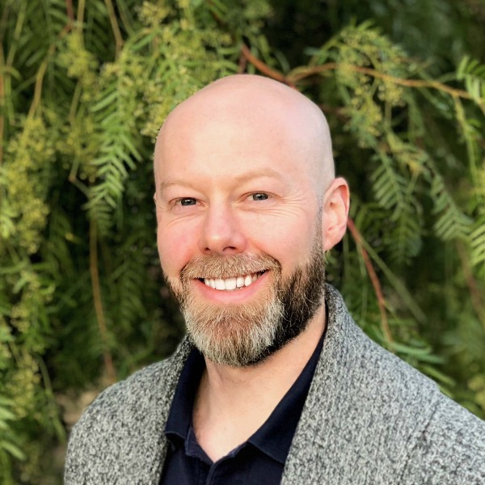
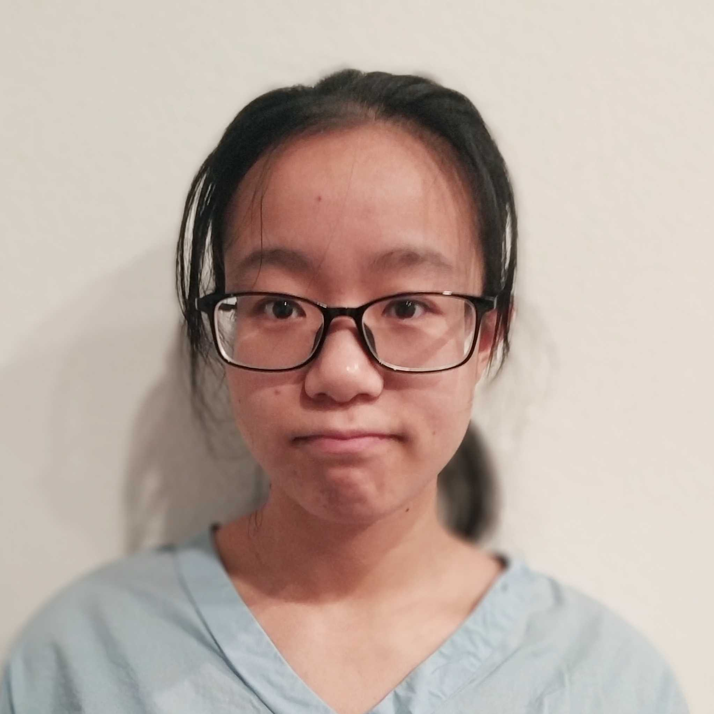
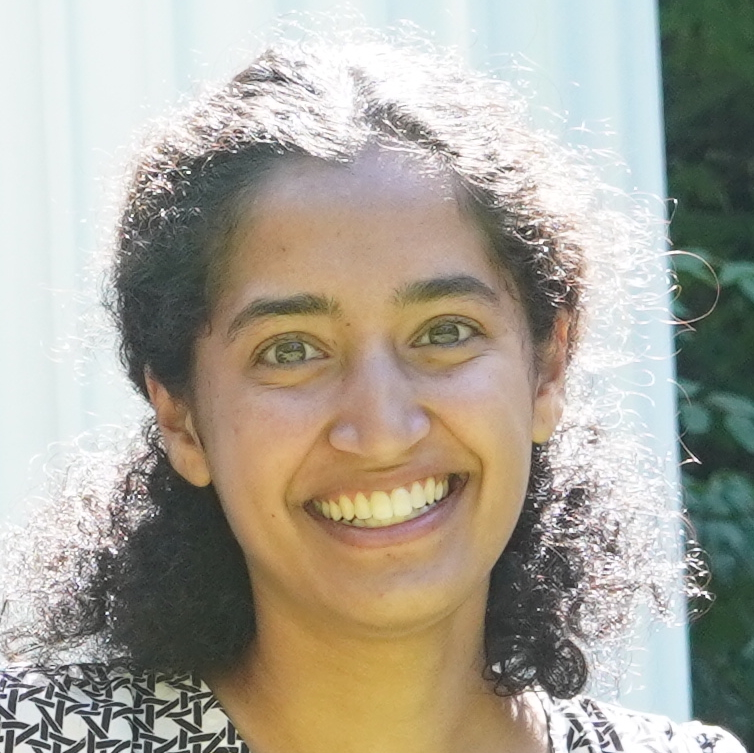
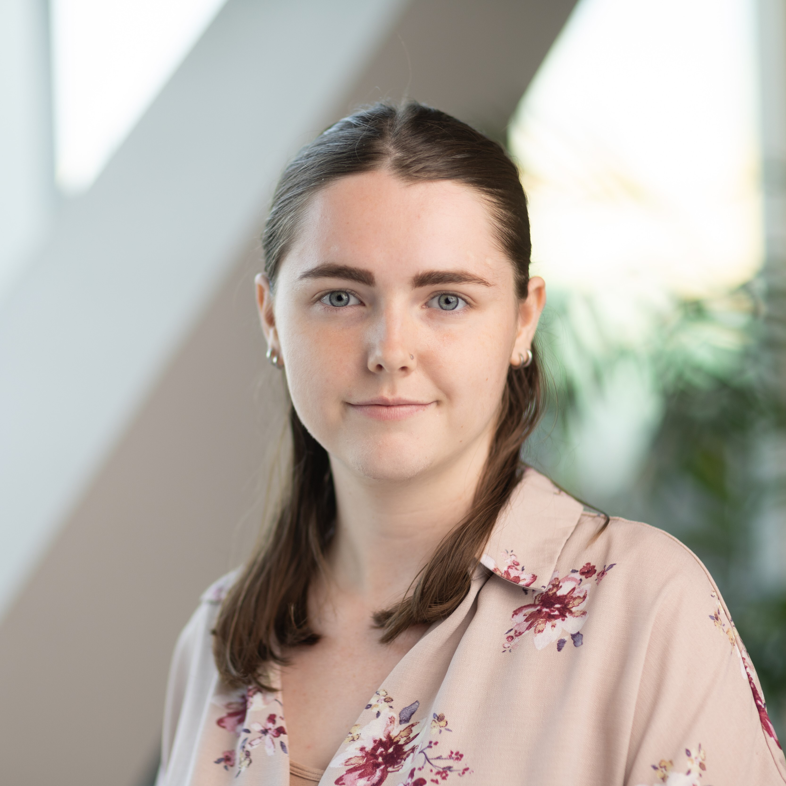
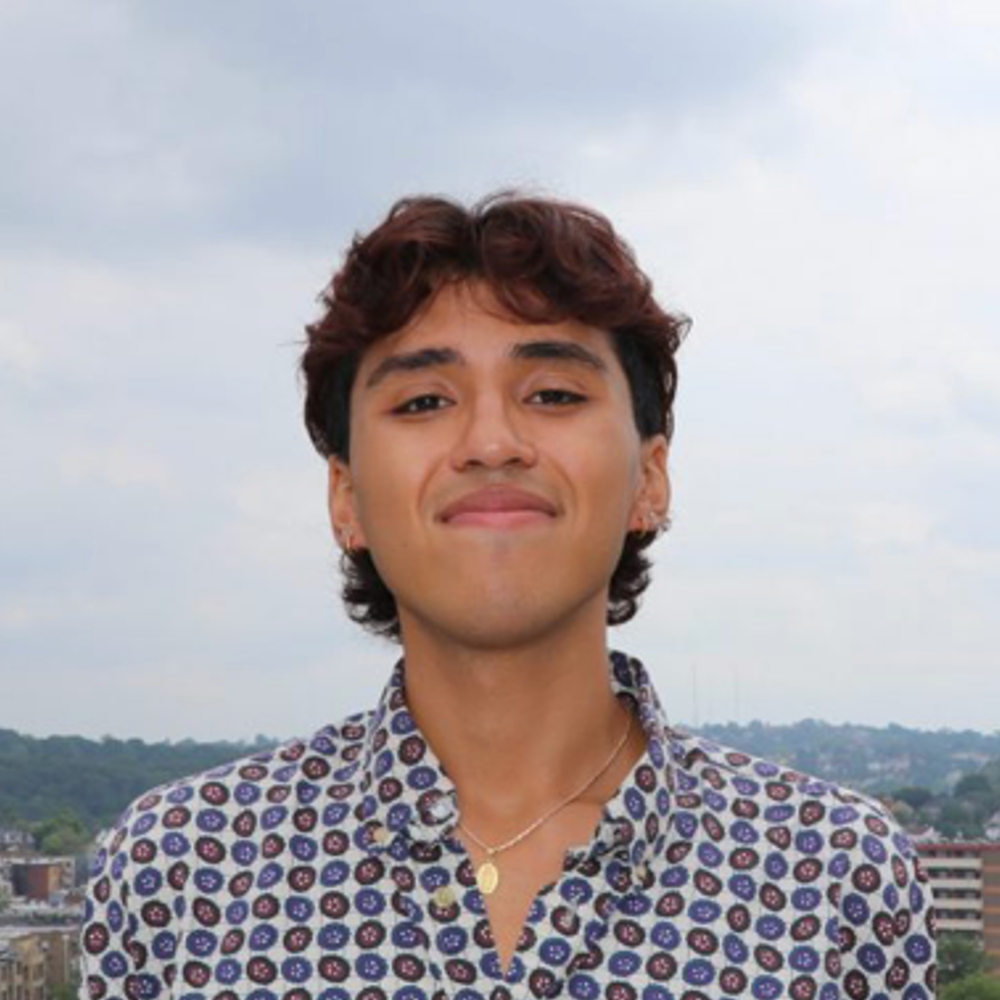
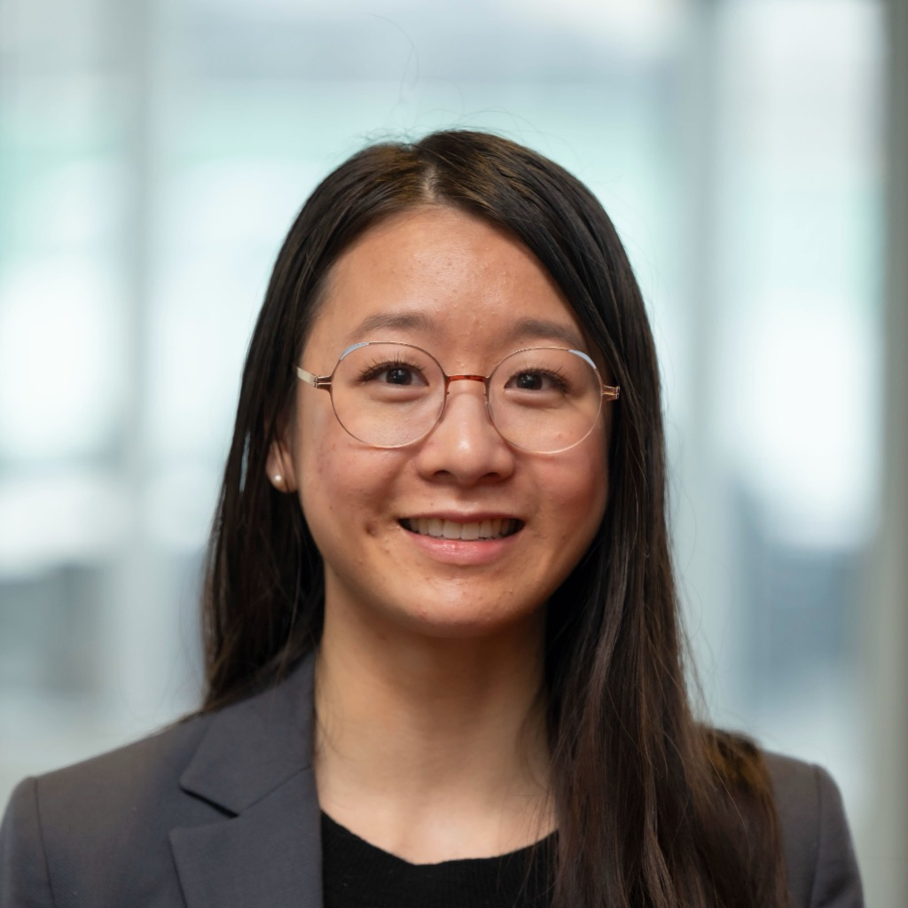

---
hide:
  - navigation
  - toc
---

-    
    __John Barton, PI__&nbsp;&nbsp;
    <small>
    [:fontawesome-brands-google-scholar:{ .middle }](https://scholar.google.com/citations?user=ItAcAOMAAAAJ) 
    [:fontawesome-brands-github:{ .middle }](https://github.com/johnbarton) 
    John is an Associate Professor of Computational and Systems Biology at the University of Pittsburgh. He studies pathogen evolution and immunology using methods inspired by statistical physics.
    </small>

-    
    __Yirui Gao, Graduate Student__&nbsp;&nbsp;
    <small>
    [:fontawesome-brands-github:{ .middle }](https://github.com/yiruigaoo)
     
    Yirui is interested in fitness inference from evolutionary histories using methods from statistical physics. Recently, she has been working on using quantitative trait models to study HIV evolution.
    </small>

-    
    __Gargi Kher, Graduate Student__&nbsp;&nbsp;
    <small>
    [:fontawesome-brands-github:{ .middle }](https://github.com/kherg)
     
    Gargi is a CMU-Pitt Computational Biology PhD student co-mentored by [Dr. Shikhar Uttam](https://www.uttamlab.com/). She's broadly interested in using quantitative methods to understand how the decisions, interactions and spatial organization of components of our immune system contribute to disease.
    </small>

-    
    __Maddie Shaklee, Graduate Student__&nbsp;&nbsp;
    <small>
    [:fontawesome-brands-google-scholar:{ .middle }](https://scholar.google.com/citations?user=GRWfK_QAAAAJ)
    [:fontawesome-brands-github:{ .middle }](https://github.com/m-shaklee)
     
    Maddie is a CMU-Pitt Computational Biology PhD student co-advised with [Dr. Harinder Singh](https://www.immunology.pitt.edu/people/harinder-singh-phd). She is interested in using computational and mathematical approaches to understand how immune cells sense and respond to signals, with a focus on how T-cell activation thresholds shape immune memory and disease outcomes.
    </small>

-    
    __Dylan Wells, Graduate Student__&nbsp;&nbsp;
    <small>
    [:fontawesome-brands-google-scholar:{ .middle }](https://scholar.google.com/citations?user=43LeKrgAAAAJ)
    [:fontawesome-brands-github:{ .middle }](https://github.com/dylanwells37)
     
    Dylan is a Pitt Physics PhD student. He has previously worked in building evolutionary algorithms to optimize radio astronomy instrumentation. Now, he is largely interested in using computation and statistical physics to study evolutionary dynamics and fitness inference.
    </small>

-    
    __Saúl Castillo, Graduate Student__&nbsp;&nbsp;
    <small>
    [:fontawesome-brands-github:{ .middle }](https://github.com/SaulCastillo-1021)
     
    Saúl is a CMU-Pitt Computational Biology Ph.D. student interested in predictive models of viral evolution and the role of antigenic properties in shaping evolutionary dynamics.
    </small>

-    
    __Meilin Scott, Master's Student__&nbsp;&nbsp;
    <small>
     
    Meilin is a Master’s student in Automated Science - Biological Experimentation at Carnegie Mellon University. She is focused on the evolution of the HMPV virus.
    </small>

## Alumni

### Postdocs

**Kai Shimagaki**, currently Assistant Research Scientist at the University of Michigan Center for Applied and Interdisciplinary Mathematics.

**Edwin Rodríguez Horta**, currently a postdoc with [Matthew McKay](https://www.mckayspcb.com/) at the University of Melbourne.

### Graduate students

**Liz Finney**, PhD student in University of California, Riverside Department of Physics and Astronomy. Graduated 2025. Currently a postdoc with [Satoshi Okawa](https://people.dom.pitt.edu/people/satoshi-okawa-phd) at the University of Pittsburgh.

**Brian Lee**, PhD student in University of California, Riverside Department of Physics and Astronomy. Graduated 2025. 

**Kevin Yang**, PhD student in University of California, Riverside Biophysics Graduate Program. Currently working with [Roya Zandi](https://zandilab.ucr.edu/) at UCR.

**Yunxiao Li**, PhD student in University of California, Riverside Department of Physics and Astronomy. Graduated 2022. Currently at Cardinal Biocraft.

**Marco Garcia Noceda**, PhD student in University of California, Riverside Department of Physics and Astronomy. Graduated 2023. Currently at Adaptive Biotechnologies.

**Yawei Qin**, PhD student in University of California, Riverside Department of Physics and Astronomy. Graduated 2023. Currently at CGG SA.

**Zhenchen Hong**, PhD student in University of California, Riverside Department of Physics and Astronomy. Graduated 2023. Currently at Ernst and Young.

### Rotation students

**Alex DiBiasi**, PhD student in the CMU-Pitt Computational Biology Graduate Program, 2022.

**Emma Flynn**, PhD student in the CMU-Pitt Computational Biology Graduate Program, 2023.

### Undergraduate students

**Uchenna Nwaege**, Physics major and MARC U STAR Scholar at the University of California, Riverside. Graduated 2023. Currently a graduate student at the University of Michigan.

**Camille Rotemberg**, TECBio REU student, 2023. Currently an undergraduate student at Cooper Union.
